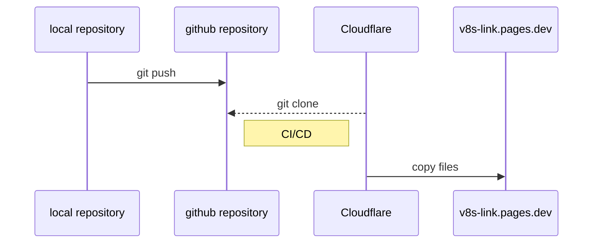

The secret sauce are two plain text files:
  * `build/_redirects` based on this [Cloudflare documentation](https://developers.Cloudflare.com/pages/platform/redirects)
  * `build/_headers` based on this [Cloudflare documentation](https://developers.Cloudflare.com/pages/platform/headers/)

## Questions or Feedback?


  
  
