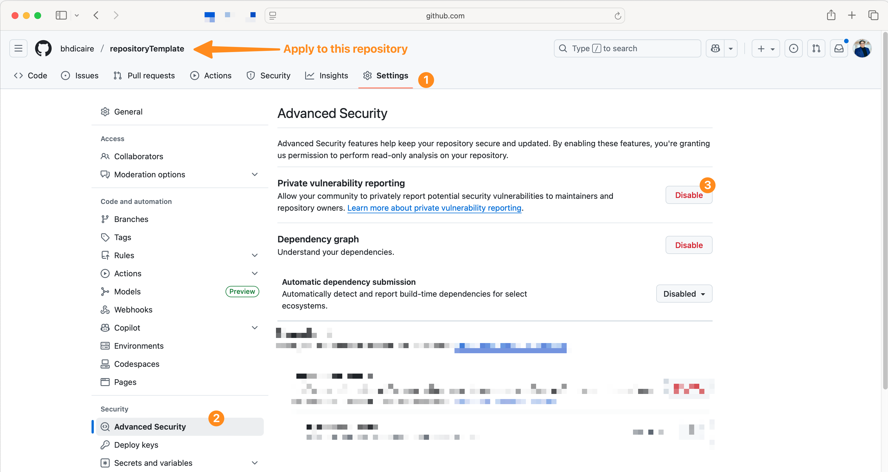
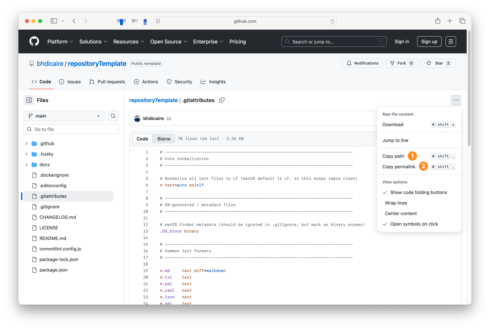
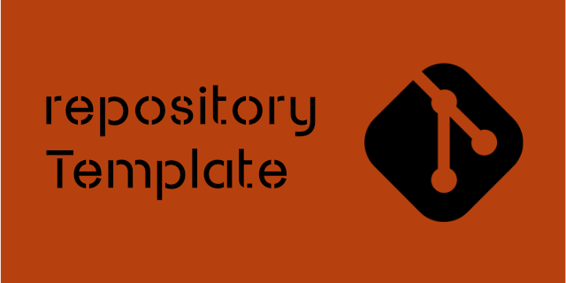

# Best practices

Follow these practices to keep your repositories consistent, secure, and easy to maintain.

**Repository Structure**

* Keep community files in the  `.github/` directory
* Place documentation under  `/docs/`
* Use meaningful names for files and directories
* Repositories should be limited to the files necessary for building projects
  * Exclude sensitive files
  * Avoid committing large binaries when possible
  * Consider [Git Large File Storage (Git LFS)](https://docs.github.com/en/repositories/working-with-files/managing-large-files/configuring-git-large-file-storage) if you must include large artifacts
* To create your own template, see [GitHub documentation](https://docs.github.com/en/repositories/creating-and-managing-repositories/creating-a-repository-from-a-template)

**Branching & Commits**

* Use short, descriptive branch names (e.g., feature/auth-login)
* Follow [Conventional Commits](https://www.conventionalcommits.org/) for commit messages

## Standard community files

Set up guidelines and governance to help collaborators contribute effectively. [:octocat:source](https://docs.github.com/en/communities/setting-up-your-project-for-healthy-contributions)

### `.github/LICENSE.md`

Add a `.github/LICENSE.md` so others know how they can use and contribute to your project. [:octocat:source](https://docs.github.com/en/repositories/managing-your-repositorys-settings-and-features/customizing-your-repository/licensing-a-repository)

This repository uses a [MIT License](https://choosealicense.com/licenses/mit/), use [choosealicense.com](choosealicense.com) to understand how to license your code.

### `.github/CODE_OF_CONDUCT.md`

Define community standards, set expectations for behavior, and explain how abuse is handled. [:octocat:source](https://docs.github.com/en/communities/setting-up-your-project-for-healthy-contributions/adding-a-code-of-conduct-to-your-project)

This repository uses a slightly modified `.github/CODE_OF_CONDUCT.md` based on the [Contributor Covenant v3.0](https://www.contributor-covenant.org/version/3/0/) to ensure that no manual changes are required per project.

### `.github/GOVERNANCE.md` and related documents

Clear ownership guidelines improve collaboration:

* `.github/GOVERNANCE.md`: how the project is governed, including project roles and how decisions are made
* `.github/CONTRIBUTING.md`: how to report bugs, request features, and submit PRs using [Github Flow](https://docs.github.com/en/get-started/using-github/github-flow)
* `.github/MAINTAINERS.md`: defines who reviews contributions, merges changes, and steers the project
* `.github/CODEOWNERS.md`: assigns maintainers to specific areas of the codebase and protects critical files such as `.github/workflows` [:octocat:source](https://docs.github.com/en/repositories/managing-your-repositorys-settings-and-features/customizing-your-repository/about-code-owners)

 `.github/SECURITY.md` provide _public_ instructions for reporting security issues. When someone opens an [issue](https://github.com/bhdicaire/repositoryTemplate/blob/main/docs/bestPractices.md#issues--prs), they’ll see a link to your security policy. [:octocat:source](https://docs.github.com/en/code-security/getting-started/quickstart-for-securing-your-repository)

### Private vulnerability reporting

Enable private reporting so vulnerabilities go directly to repository administrators. [:octocat:source](https://docs.github.com/en/code-security/security-advisories/working-with-repository-security-advisories/configuring-private-vulnerability-reporting-for-a-repository)
  

Be sure to configure notifications for these reports. :octocat:source

Enabling private reporting at the user level secures all repositories you own. [:octocat:source](https://docs.github.com/en/code-security/security-advisories/working-with-repository-security-advisories/configuring-private-vulnerability-reporting-for-a-repository#configuring-notifications-for-private-vulnerability-reporting)
  

## Issues & PRs

Add [.github/SUPPORT.md](../.github/SUPPORT.md) to explain how contributors can get help.

Add [.github/ISSUE_TEMPLATE/config.yml](../.github/ISSUE_TEMPLATE/config.yml) to customize the issue template chooser that people see when creating a [new issue](https://docs.github.com/en/communities/using-templates-to-encourage-useful-issues-and-pull-requests/configuring-issue-templates-for-your-repository#creating-issue-templates). [:octocat:source](https://docs.github.com/en/communities/using-templates-to-encourage-useful-issues-and-pull-requests/configuring-issue-templates-for-your-repository?versionId=free-pro-team%40latest&productId=communities&restPage=setting-up-your-project-for-healthy-contributions%2Cadding-a-license-to-a-repository#configuring-the-template-chooser)

Use issue templates:

 1. [Bug](../.github/ISSUE_TEMPLATE/bug.yml)
 2. [Documentation including README.md](../.github/ISSUE_TEMPLATE/docs.yml)
 3. [Feature request](../.github/ISSUE_TEMPLATE/feature-request.yml)
 4. [Question or support](../.github/ISSUE_TEMPLATE/question-support.yml)
 5. [Security report](../.github/SECURITY.md)

Add  [labels](../.github/labels.yml) for type (bug, feature, docs), status (in progress, blocked), and priority. [:octocat:source](https://docs.github.com/en/issues/using-labels-and-milestones-to-track-work/managing-labels)

Keep PRs small and focused, using the [pull request template](../.github/pull_request_template.md).

## Opinionated configurations

* `.editorconfig`: helps maintain consistent coding styles across various editors and IDEs [:link:source](https://editorconfig.org/)
* `.markdownlint.yml`: style checker and lint tool for Markdown/CommonMark files [:link:source](https://github.com/DavidAnson/markdownlint)
* `package.json`: information about the repository and required node.js modules [:link:source](https://docs.npmjs.com/cli/v11/configuring-npm/package-json)

### Versioning & Releases

* Use [Semantic Versioning](https://semver.org/spec/v2.0.0.html)
* Maintain a [CHANGELOG.md](../CHANGELOG.md) following [Keep a Changelog](https://keepachangelog.com/en)

### `.gitignore` and `.gitattributes`

* Use `.gitignore` to keep sensitive or unnecessary files out of the repository [:link:source](https://git-scm.com/docs/gitignore)
* Use `.gitattributes` to control how GitHub shows diffs and calculates repository language [:octocat:source](https://docs.github.com/en/repositories/working-with-files/managing-files/customizing-how-changed-files-appear-on-github)

## Documentation (README.md)

A well-structured `README.md` makes your project easier to understand and navigate. It shows attention to detail and commitment.

* GitHub use  [Common Marker](https://github.com/gjtorikian/commonmarker) for Markdown
  * It's support the [CommonMark specification](https://commonmark.org/) and extensions documented in the [GitHub Flavored Markdown spec](http://github.github.com/gfm/), such as support for tables, strikethroughs, and autolinking. [:octocat:source](https://docs.github.com/en/get-started/writing-on-github/getting-started-with-writing-and-formatting-on-github/basic-writing-and-formatting-syntax)
* Add [badges](./badges.md]) to show build status, coverage, or other project metadata
* Use [emojis](./emojis.md) to make issues and PRs easier to read

### Permanent File Links

When linking to files:

* A branch link always points to the latest version:
<https://github.com/bhdicaire/repositoryTemplate/blob/main/.gitattributes>
* A permalink uses a commit hash, ensuring the content never changes:
<https://github.com/bhdicaire/repositoryTemplate/blob/`><commit>`/.gitattributes [:octocat:source](https://docs.github.com/en/repositories/working-with-files/using-files/getting-permanent-links-to-files)
  * It replaces the branch name with the specific commit ID, such as <https://github.com/bhdicaire/repositoryTemplate/blob/608961066353ea6093b0afb6a3e8a504ddf828cf/.gitattributes>

#### Visuals

Add images to improve readability:

* Header image: 1200 × 300 px @ 72 DPI
* Social media preview: 640 × 320 px @ 72 DPI

Upload a  [social media image](./socialMedia.png) to customize your repo’s appearance. [:octocat:source]((https://docs.github.com/en/repositories/managing-your-repositorys-settings-and-features/customizing-your-repository/customizing-your-repositorys-social-media-preview) )

## GitHub Accounts and Organisations

Usually you're personal GitHub account is also used to collaborate in your organizations' repositories ...

* Use [strong, unique passwords](https://docs.github.com/en/authentication/keeping-your-account-and-data-secure/creating-a-strong-password) with a password manager [:octocat:source](https://docs.github.com/en/code-security/supply-chain-security/end-to-end-supply-chain/securing-accounts)
* Enforce [two-factor authentication](https://docs.github.com/en/authentication/securing-your-account-with-two-factor-authentication-2fa/configuring-two-factor-authentication) [:octocat:](https://docs.github.com/en/organizations/keeping-your-organization-secure/managing-two-factor-authentication-for-your-organization/requiring-two-factor-authentication-in-your-organization)
* Use [SSH Keys](https://docs.github.com/en/authentication/connecting-to-github-with-ssh/about-ssh) for authentication and commit signing
* Enable push protection to prevent committing secrets
  * Users in the [GitHub UI](https://docs.github.com/en/code-security/secret-scanning/working-with-secret-scanning-and-push-protection/working-with-push-protection-in-the-github-ui) and from the [command line](https://docs.github.com/en/code-security/secret-scanning/working-with-secret-scanning-and-push-protection/working-with-push-protection-from-the-command-line)
  * [Push protection for repositories and organizations](https://docs.github.com/en/code-security/secret-scanning/introduction/about-push-protection) (e.g., [secret scanning](https://docs.github.com/en/code-security/secret-scanning/introduction/supported-secret-scanning-patterns) feature) [:octocat:source](https://docs.github.com/en/code-security/getting-started/best-practices-for-preventing-data-leaks-in-your-organization)
* Assign at least two owners per organization to ensure continuity
  * Keep in mind that organization owners have full administrative access to the organization
* Access [GitHub's compliance reports](https://docs.github.com/en/organizations/keeping-your-organization-secure/managing-security-settings-for-your-organization/accessing-compliance-reports-for-your-organization) (SOC, CSA CAIQ, etc.) for your organization
